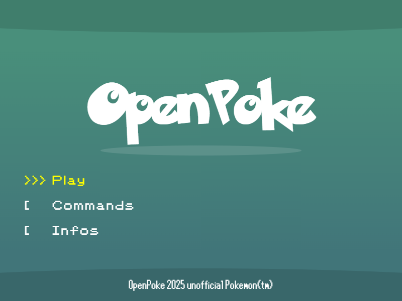
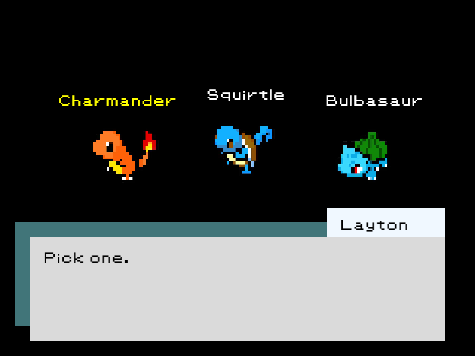
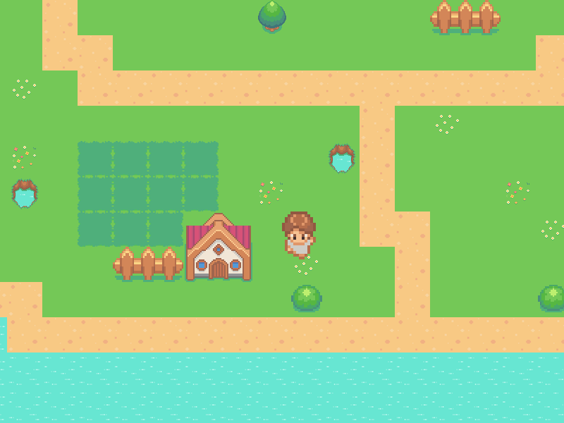
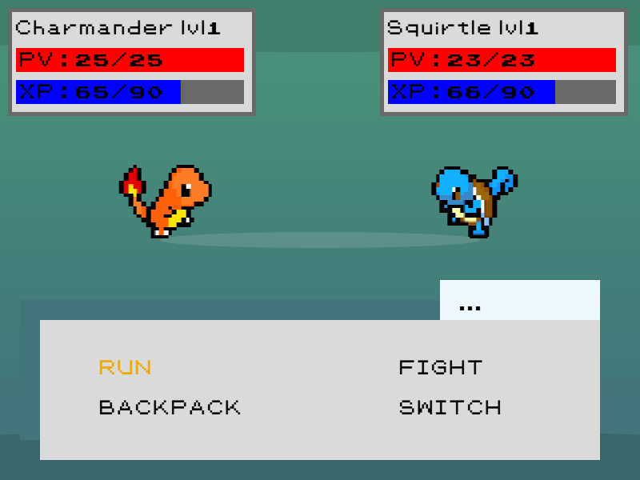

#  OpenPoke

OpenPoke is distributed under the [WTFPL](LICENSE).

---

## How to play OpenPoke ?

**[Click here to play now](https://anto.infos.st/OpenPoke/)**

> Link doesn't works ?

Try <https://anto.infos.st/OpenPoke/> or <https://antoinelandrieux.github.io/OpenPoke/>

**Play in local**:

You need a local server to play

## Gameplay

>
> 
>
> 
>
> 
>
> 
>

## Contributing

The OpenPoke source code is located in the Git repository at [github.com/AntoineLandrieux/OpenPoke](https://github.com/AntoineLandrieux/OpenPoke/).
Contributions are most welcome by forking the repository and sending a pull request.

## Credit

See **[AUTHORS file](AUTHORS)**

**Contributors :**

